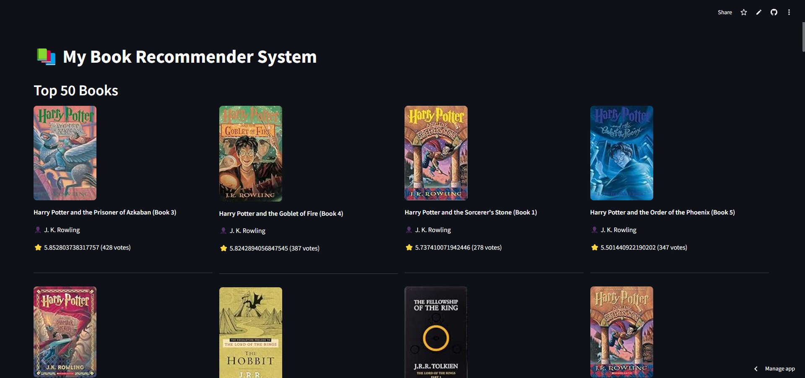

# Book Recommender System

## 📖 Overview
This is a **Book Recommender System** built using **Streamlit** for the frontend and trained on the **Kaggle Book Recommendation Dataset**. The system allows users to:
- View the **Top 50 popular books** based on ratings.
- Get **personalized book recommendations** by entering a book title.

## 🚀 Features
- Displays the **top-rated books** with images, authors, and ratings.
- Provides **book recommendations** based on similarity scores.
- Simple and interactive UI using **Streamlit**.

## 📂 Dataset
The dataset used is the **Kaggle Book Recommendation Dataset**, which includes:
- Book details such as **title, author, and image URL**.
- User ratings for various books.

## 🔧 Installation
### 1️⃣ Clone the Repository
```bash
git clone https://github.com/your-repo/book-recommender.git
cd book-recommender
```

# APP Image


# Live Demo
[Live-Demo]("https://https://book-recommender-cdpvvpgb5myz5rgvrmmwin.streamlit.app/")

